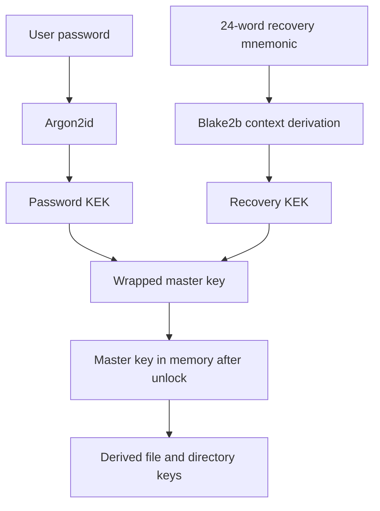

# Security

## Important warning
AxiomVault is still in **early development** and is **not production ready**.
Exact primitive choices, vault serialization details, and secret-handling behavior should be validated against the tagged `axiom-core` and `axiom-cli` source before production reliance; this page is documentation, not a substitute for code review.

## Security model
- Client-side encryption first
- Zero-knowledge architecture as a design goal
- Authenticated encryption on every chunk
- Chunk ordering protection
- Memory zeroization for key material
- Constant-time comparisons where appropriate
- No plaintext secrets in logs

## Crypto and data protection

| Area | Detail |
| --- | --- |
| Content encryption | XChaCha20-Poly1305 |
| Key derivation | Argon2id |
| Hashing | Blake2b |
| Recovery key | 24-word BIP39 mnemonic |

## Trust assumptions
AxiomVault's security depends on these assumptions:
- Build artifacts are produced from reviewed source.
- Rust's memory safety guarantees hold outside explicitly-audited `unsafe` blocks.
- The underlying cryptographic primitives remain sound.
- The OS kernel and FUSE subsystem correctly enforce mount permissions.

## Key hierarchy

The master key is randomly generated and stored only in wrapped form. Two independent KEKs can unwrap it: one from the password and one from the recovery mnemonic.

## File encryption
Files are encrypted using chunked streaming encryption. Each chunk is independently authenticated, and chunk indices are included in authenticated data to help detect reordering or truncation.

## Security practices
- Dependency auditing with `cargo audit`
- Secret scanning with `gitleaks`
- Lint enforcement with `cargo clippy -D warnings`
- `// SAFETY:` comments for every `unsafe` block
- `Zeroize` and `ZeroizeOnDrop` on sensitive key material
- Constant-time comparisons for sensitive equality checks

## What this page does not claim
This page describes the intended design and current implementation direction. It does **not** claim:
- an external security audit
- completed hardening across all platforms
- a stable long-term vault format guarantee
- safety against a compromised endpoint
- implemented MCP-based security controls
- implemented YubiKey or other hardware-key backed unlock flows

## Related pages
- [Threat Model](threat-model.md)
- [MCP Status](mcp-status.md)
- [YubiKey and Hardware Keys](yubikey-and-hardware-keys.md)
- [Current Limitations](current-limitations.md)

## Supported versions
Only the latest release receives security patches.
