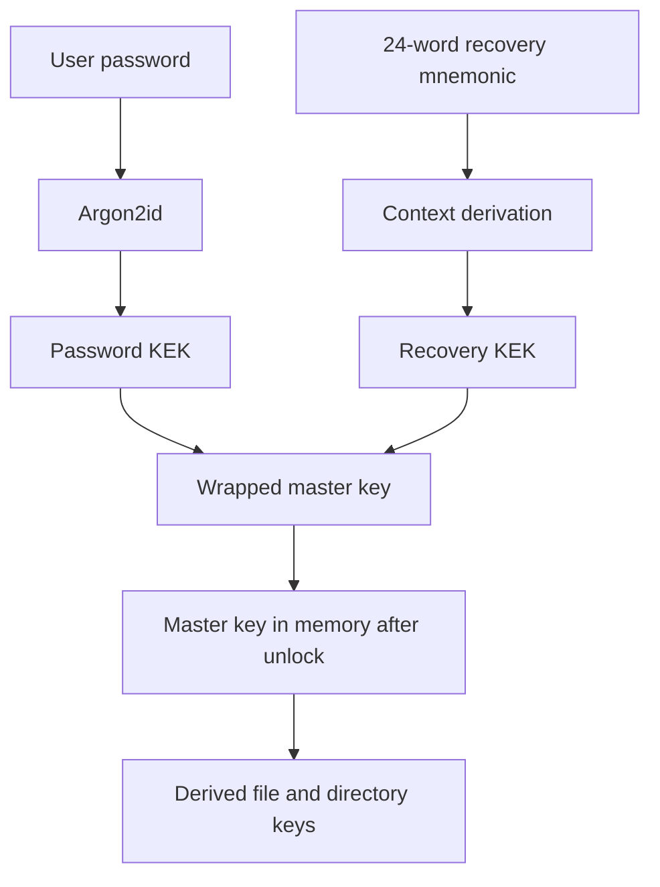

# Security

## Important warning

AxiomVault is **not production ready**. Statuses use the vocabulary defined on the [overview](README.md#status-vocabulary) and reflect `axiom-core@b6520ff` plus `axiom-cli@7b436af`, not future fixes or a released security claim.

## Protection status

| Area | Status | Verified boundary |
| --- | --- | --- |
| XChaCha20-Poly1305 content protection | **available** | Authenticated encryption primitives and authenticated chunk indices exist. |
| Argon2id password derivation and mnemonic recovery wrapping | **available** | No external audit or stable-format guarantee is claimed. |
| Bounded-memory authenticated streaming | **unavailable** | Current stream and higher-layer file paths buffer the complete input/output; late authentication must not be treated as atomic plaintext publication ([core #18](https://github.com/axiom-vault/axiom-core/issues/18), [CLI #24](https://github.com/axiom-vault/axiom-cli/issues/24)). |
| Remote snapshot freshness / rollback rejection | **unavailable** | Valid older ciphertext can be replayed because there is no trusted monotonic freshness anchor ([core #13](https://github.com/axiom-vault/axiom-core/issues/13)). |
| OAuth credential locality | **unavailable** | Provider configuration can serialize tokens into portable `vault.config` data ([core #11](https://github.com/axiom-vault/axiom-core/issues/11), [CLI #22](https://github.com/axiom-vault/axiom-cli/issues/22)). |
| Authenticated WebDAV | **unavailable** | The endpoint serves an unlocked vault without request authentication ([core #12](https://github.com/axiom-vault/axiom-core/issues/12), [CLI #23](https://github.com/axiom-vault/axiom-cli/issues/23)). |
| Plaintext local-index fail-closed protection | **experimental-incomplete** | Restrictive creation and wipe are attempted, but failures/path substitution are not consistently blocking ([core #16](https://github.com/axiom-vault/axiom-core/issues/16)). |
| Authenticated atomic legacy migration | **experimental-incomplete** | The FFI migration password is not consumed and recovery output/rollback are incomplete ([core #17](https://github.com/axiom-vault/axiom-core/issues/17)). |

## Key hierarchy

The master key is randomly generated and stored wrapped. Password-derived and recovery-derived keys can unwrap it. Protect both credentials; either can grant access.

## Chunking versus streaming

File ciphertext can be split into independently authenticated chunks with chunk ordering data. The reviewed implementation nevertheless accumulates encrypted chunks before writing, and vault, provider, CLI, and WebDAV paths commonly operate on whole buffers. Large-file memory use can therefore grow with file size. Do not describe this as end-to-end streaming or atomic safe publication until [core #18](https://github.com/axiom-vault/axiom-core/issues/18) and [CLI #24](https://github.com/axiom-vault/axiom-cli/issues/24) ship and are verified.

## OAuth credentials and rotation

The reviewed Google Drive create/open path loads a local token file, serializes the tokens into provider configuration, and can persist that configuration with the portable vault. A token file being local or mode `0600` does **not** guarantee that its credential values remain local.

If a cloud vault was created or opened with an affected revision:

1. treat its OAuth access/refresh tokens and any client secret as potentially retained in remote object history, backups, or caches;
2. revoke the grant with the provider and rotate any client secret;
3. re-authenticate only after the credential-reference fixes in [core #11](https://github.com/axiom-vault/axiom-core/issues/11) and [CLI #22](https://github.com/axiom-vault/axiom-cli/issues/22) are shipped in the exact CLI revision you use.

Sanitizing only the newest configuration cannot erase older remote versions.

## Freshness and trust on first use

AEAD detects modification of authenticated bytes; it does not prove that those bytes are the newest generation. There is currently no implemented trust-on-first-use enrollment or trusted local freshness anchor. A storage attacker can replay an older internally valid snapshot or mix generations without a documented rollback alarm. Recovery on a new device also has no previously trusted local anchor. This work is tracked in [core #13](https://github.com/axiom-vault/axiom-core/issues/13).

## Local index confidentiality

The portable tree index is encrypted. Separately, `core/app` can attach a SQLite local index containing plaintext filenames, hierarchy, sizes, and timestamps for caching. It is intended to be owner-only and wiped on lock/close, but protection and cleanup failures are not consistently fail-closed. Filesystem permissions are not encryption, and SQLite deletion is not a secure-erasure guarantee. See [core #16](https://github.com/axiom-vault/axiom-core/issues/16).

## What this page does not claim

- an external security audit or formal verification;
- a stable long-term vault format;
- safety against a compromised endpoint;
- multi-device convergence or rollback resistance;
- credential locality for current cloud workflows;
- authenticated WebDAV;
- that fixes tracked in linked issues are shipped.

## Related pages

- [Threat Model](threat-model.md)
- [Current Limitations](current-limitations.md)
- [Sync and Cloud](sync-and-cloud.md)
