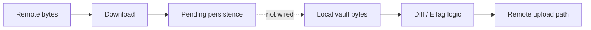

# Sync and Cloud

AxiomVault is designed to encrypt data before remote storage, but provider availability is not the same as verified multi-device convergence. Statuses below use the [site vocabulary](README.md#status-vocabulary) and the reviewed default-branch revisions.

## Capability status

| Capability | Status | Current boundary |
| --- | --- | --- |
| Local filesystem provider | **available** | Suitable for local experimentation; broader vault durability limitations still apply. |
| Google Drive provider and OAuth flow | **experimental-incomplete** | Commands and resumable upload code exist, but credentials can be embedded in portable configuration. |
| Manual `sync run` command | **experimental-incomplete** | It can diff/upload/download, but downloaded remote bytes are not persisted into durable local vault state. |
| ETag comparison and conflict strategy types | **scaffolded** | Strategies exist, but they cannot establish end-to-end convergence while remote persistence is missing. |
| Periodic/on-demand background sync | **scaffolded** | CLI configuration and scheduler types exist; there is no verified long-running CLI service applying them. |
| iCloud and Dropbox CLI remotes | **unavailable** | Placeholder commands report future support. |
| OneDrive CLI remote | **unavailable** | No documented CLI command. |

## Sync correctness boundary

At [`axiom-core@b6520ff`](https://github.com/axiom-vault/axiom-core/commit/b6520ff6e453cc1c2a74d78c25f11a35ec75408c), the sync engine downloads remote ciphertext but records it as pending because no local persistence destination is wired. It can therefore report activity without making the remote version durable locally, and state/ETag ordering does not yet prove convergence. Do not rely on sync as a backup, restore, or multi-device consistency mechanism. The implementation work and deterministic convergence tests are tracked in [core #15](https://github.com/axiom-vault/axiom-core/issues/15).



Conflict options accepted by the CLI are `keep-both`, `prefer-local`, and `prefer-remote`. “Manual handling” is not a strategy value accepted by `sync run`.

## Google Drive credentials

The reviewed CLI `remote gdrive auth` command writes a token JSON file. The create/open commands then deserialize that file and serialize the full token-bearing `GDriveConfig` as provider configuration. Because portable vault configuration is saved through the provider, credentials may be uploaded and retained in remote history.

Credential locality is therefore **unavailable**, not an established zero-knowledge property. Core separation and CLI credential-reference work are tracked in [core #11](https://github.com/axiom-vault/axiom-core/issues/11) and [CLI #22](https://github.com/axiom-vault/axiom-cli/issues/22).

If you used an affected cloud workflow, revoke the provider grant, rotate any client secret, and re-authenticate only with a revision that verifiably includes both fixes. Updating the latest remote object alone cannot erase history or backups.

## Command surface, not a convergence endorsement

These commands exist in [`axiom-cli@7b436af`](https://github.com/axiom-vault/axiom-cli/commit/7b436aff5a8d5236d075a9e2bfe7f998d171b83c):

```bash
axiom remote gdrive auth --output ~/gdrive-tokens.json
axiom remote gdrive create \
  --name CloudVault \
  --folder-id YOUR_FOLDER_ID \
  --tokens ~/gdrive-tokens.json
axiom remote gdrive open \
  --folder-id YOUR_FOLDER_ID \
  --tokens ~/gdrive-tokens.json

axiom sync run --vault-path ~/my-vault --strategy keep-both
axiom sync status --vault-path ~/my-vault
axiom sync configure --vault-path ~/my-vault --mode periodic --interval 300
```

Running them does not remove the persistence, background lifecycle, credential, rollback, or whole-buffer limitations. The CLI also pins an older core revision; follow [CLI #25](https://github.com/axiom-vault/axiom-cli/issues/25) before attributing newer core behavior to it.
