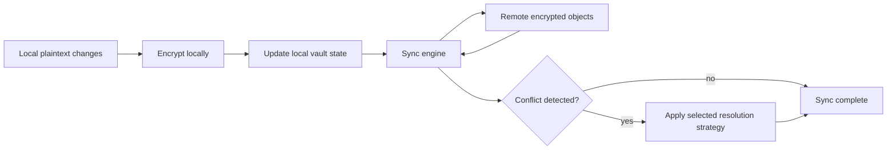

# Sync and Cloud

AxiomVault is designed to encrypt data before it touches cloud storage.

## Current remote support

- Google Drive with OAuth2 and resumable uploads
- Local filesystem storage for offline or self-hosted workflows

## Planned remote support

These are roadmap items, not current capabilities:

- iCloud
- Dropbox
- OneDrive

## Sync behavior

The sync engine supports:

- On-demand sync runs
- Periodic background sync
- ETag-based conflict detection
- Conflict resolution strategies such as `keep-both`, prefer local, prefer remote, and manual handling
- Retry with exponential backoff

## Simplified sync flow



## Typical flow

```bash
axiom remote gdrive auth --output ~/gdrive-tokens.json
axiom sync run --vault-path ~/my-vault --strategy keep-both
axiom sync status --vault-path ~/my-vault
```

## Caveats

- Sync correctness matters as much as encryption correctness for real users.
- Remote providers may differ in metadata, retry, and error behavior.
- OAuth tokens and local backend credentials should be handled as secrets and stored with restrictive permissions.
- Treat backend support as evolving until compatibility guarantees are documented.
