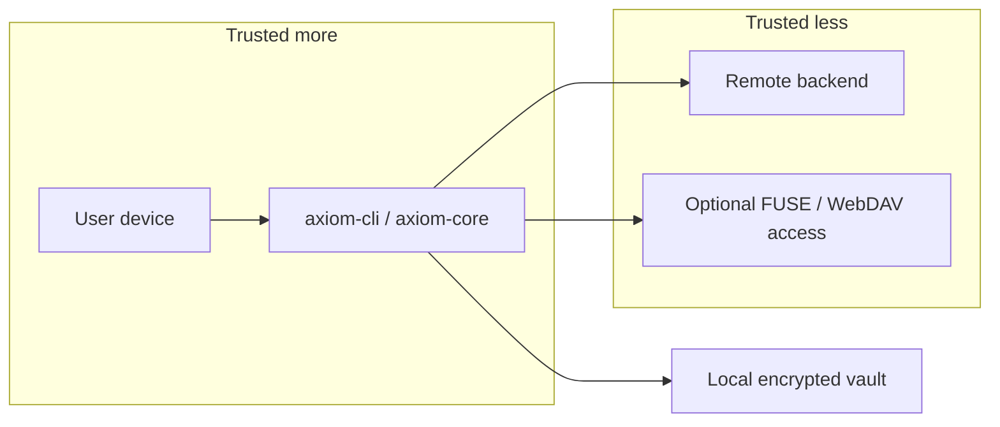

# Threat Model

## Status

This threat model describes the **intended security boundaries** of AxiomVault in its current early-development state. It is not a claim of completed review, audit, or production hardening.

## Security goals

AxiomVault is designed to reduce risk in these areas:

- Protect file contents before data is uploaded to a remote backend
- Prevent storage providers from learning plaintext file data
- Preserve integrity of encrypted chunks and vault metadata
- Allow recovery of the same master key through either a password-derived key or a recovery mnemonic

## Assets to protect

- Master key
- Password-derived KEK
- Recovery-derived KEK
- Plaintext file contents
- Plaintext filenames and directory structure
- OAuth tokens or remote credentials
- Local vault configuration and sync state

## Trust boundaries

## Threats the design tries to address

### Remote storage compromise

If a cloud provider account or backend is read without access to vault keys, the design intends that the attacker sees encrypted blobs and encrypted metadata rather than plaintext file contents.

### Network or transport observation

AxiomVault assumes transport security still matters, but the main confidentiality control is local encryption before upload.

### Chunk tampering or reordering

Chunk authentication and authenticated chunk ordering are intended to detect modified, truncated, or reordered encrypted content.

### Accidental secret exposure in logs

The implementation aims to avoid plaintext secrets in logs and to zeroize sensitive key material where practical.

## Threats not fully solved

### Compromised endpoint

If the user device is already compromised while the vault is unlocked, malware, keyloggers, or memory inspection can still expose plaintext data or credentials.

### Malicious or vulnerable dependencies

Client-side encryption does not protect against vulnerable build inputs, compromised packages, or malicious updates.

### Unsafe access layers

FUSE and WebDAV improve usability, but they also increase the attack surface and rely on the host OS and surrounding tooling to enforce access controls correctly.

## Out of scope assumptions

AxiomVault currently assumes:

- the operating system is enforcing file permissions correctly
- cryptographic primitives remain secure
- reviewed source matches shipped binaries
- users protect passwords, recovery phrases, and OAuth tokens

## Open risks for an early project

- limited external review and no production audit claim
- possible vault format and sync behavior changes
- incomplete hardening around operational edge cases
- backend-specific bugs that may affect sync correctness or recovery workflows

## See also

- [Security](security.md)
- [Current Limitations](current-limitations.md)
- [Sync and Cloud](sync-and-cloud.md)
