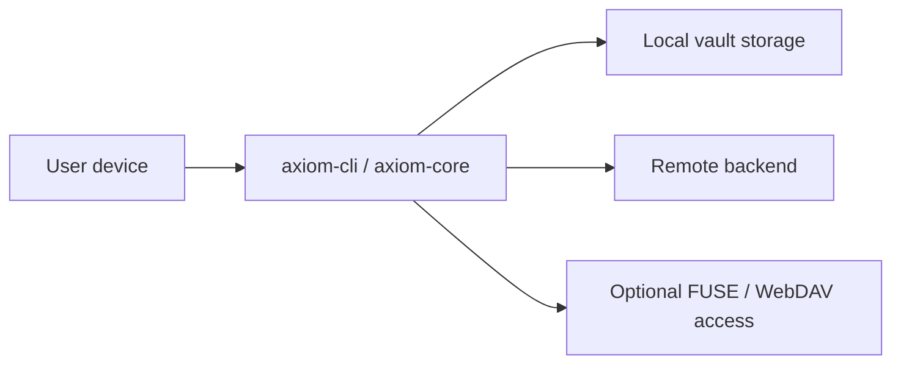

# Threat Model

## Status

This threat model separates implemented controls from design goals. It uses the [site status vocabulary](README.md#status-vocabulary) for `axiom-core@b6520ff` and `axiom-cli@7b436af`; linked issue work is not yet a shipped fix.

## Assets

- Master key, password-derived key, and recovery mnemonic
- Plaintext contents, filenames, hierarchy, sizes, and timestamps
- OAuth access/refresh tokens, client secrets, and local credential files
- Portable vault configuration and encrypted tree/object data
- Local sync state, staging data, and optional plaintext SQLite index

## Trust boundaries

The endpoint and unlocked process are trusted. Remote storage, network peers, mount clients, and WebDAV clients are not trusted with plaintext. At the reviewed revisions, some implementation gaps cross those intended boundaries.

## Threats and current coverage

| Threat | Status | Current coverage |
| --- | --- | --- |
| Remote reads or byte modification | **available** for authenticated confidentiality/integrity | Without vault keys, content encryption is intended to hide plaintext and reject modified authenticated bytes. Metadata leakage and implementation defects remain possible. |
| Replay of an older valid snapshot | **unavailable** | No trusted freshness anchor or implemented TOFU enrollment rejects rollback ([core #13](https://github.com/axiom-vault/axiom-core/issues/13)). |
| Multi-device divergence/data loss | **experimental-incomplete** | Sync can compare and download, but does not durably apply remote bytes before state transitions ([core #15](https://github.com/axiom-vault/axiom-core/issues/15)). |
| OAuth credential disclosure through portable config | **unavailable** credential-locality guarantee | Tokens can be serialized into provider configuration and uploaded ([core #11](https://github.com/axiom-vault/axiom-core/issues/11), [CLI #22](https://github.com/axiom-vault/axiom-cli/issues/22)). |
| Unauthenticated local WebDAV client | **unavailable** authentication | Any process able to reach the listener can request unlocked metadata/content or mutations. CLI loopback binding reduces network exposure but is not authentication ([core #12](https://github.com/axiom-vault/axiom-core/issues/12)). |
| Large-file memory exhaustion or partial plaintext publication | **experimental-incomplete** | Chunk authentication exists, but end-to-end paths use whole buffers and safe atomic publication is not complete ([core #18](https://github.com/axiom-vault/axiom-core/issues/18), [CLI #24](https://github.com/axiom-vault/axiom-cli/issues/24)). |
| Local plaintext metadata disclosure | **experimental-incomplete** | The optional SQLite index attempts owner-only permissions and wipe-on-lock, but does not consistently fail closed ([core #16](https://github.com/axiom-vault/axiom-core/issues/16)). |
| Unauthorized or interrupted legacy migration | **experimental-incomplete** | Authentication, atomic rollback, and recovery-material ownership remain open ([core #17](https://github.com/axiom-vault/axiom-core/issues/17)). |

## Important scenarios

### Compromised endpoint

A compromised device can read plaintext and credentials while the vault is unlocked. Client-side encryption does not defend against keyloggers, malicious builds, memory inspection, or a hostile client process.

### WebDAV and FUSE

These access layers deliberately expose plaintext views to local clients. WebDAV is especially unsafe in the reviewed implementation because protected methods are unauthenticated. The CLI selects `127.0.0.1`, but the reusable core accepts configurable binding without enforcing an exclusively loopback address. Do not expose it to a LAN or untrusted local users.

### Cloud history and credential rotation

Removing credentials from a current object cannot remove prior remote versions, provider backups, or caches. Users of affected Google Drive workflows should revoke and rotate credentials as described in [Security](security.md#oauth-credentials-and-rotation).

### Snapshot recovery and new devices

Per-object authentication does not establish freshness. A first open on a new device has no trusted local history; current code does not implement an explicit TOFU ceremony or recovery override. Treat remote rollback detection as **unavailable**.

## Out of scope assumptions

- The operating system and cryptographic libraries behave correctly.
- Reviewed source matches the binary being run.
- Users protect passwords, recovery phrases, and credential files.
- A compromised unlocked endpoint cannot be made safe by storage encryption alone.

## See also

- [Security](security.md)
- [Current Limitations](current-limitations.md)
- [Sync and Cloud](sync-and-cloud.md)
