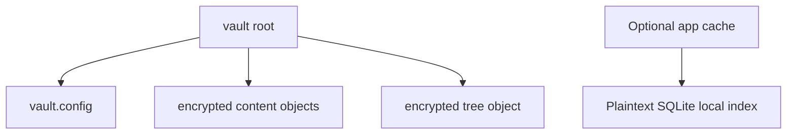

# Vault Format

A vault contains portable configuration, encrypted content/metadata objects, and an encrypted tree. The format is early-development and has no stable compatibility guarantee.

## Simplified layout

Exact object names and layout can vary by provider and format revision; this diagram is conceptual rather than a compatibility contract.

## Confidentiality boundaries

- File content and the portable directory tree use authenticated encryption.
- `vault.config` contains salts, KDF parameters, provider identity/configuration, timestamps, and wrapped or verification material. Do not assume every configuration field is secret merely because key material is wrapped.
- At the reviewed revisions, provider configuration can contain serialized OAuth tokens. This defeats a local-only credential boundary and may place credentials in remote history ([core #11](https://github.com/axiom-vault/axiom-core/issues/11), [CLI #22](https://github.com/axiom-vault/axiom-cli/issues/22)).
- `core/app` can maintain a separate local SQLite index with plaintext filenames, hierarchy, sizes, and timestamps. It is not part of the encrypted portable tree. Permission enforcement and wipe-on-lock are **experimental-incomplete** ([core #16](https://github.com/axiom-vault/axiom-core/issues/16)).

## Integrity is not freshness

Authenticated objects can detect modification, but an internally valid older object or snapshot can still be replayed. Snapshot rollback detection and an explicit trust-on-first-use/freshness anchor are **unavailable** ([core #13](https://github.com/axiom-vault/axiom-core/issues/13)).

## Chunking is not bounded-memory streaming

Content encryption has chunk primitives, but current code accumulates chunks and higher layers exchange complete buffers. End-to-end bounded-memory streaming is **unavailable** ([core #18](https://github.com/axiom-vault/axiom-core/issues/18)).

## Migration boundary

The CLI exposes `axiom vault migrate --path PATH [--dry-run]`, but authenticated, atomic legacy migration with safe recovery-material return is **experimental-incomplete**. In particular, the reviewed FFI path accepts a password without using it. Preserve an independent verified backup before experimenting; see [core #17](https://github.com/axiom-vault/axiom-core/issues/17).
