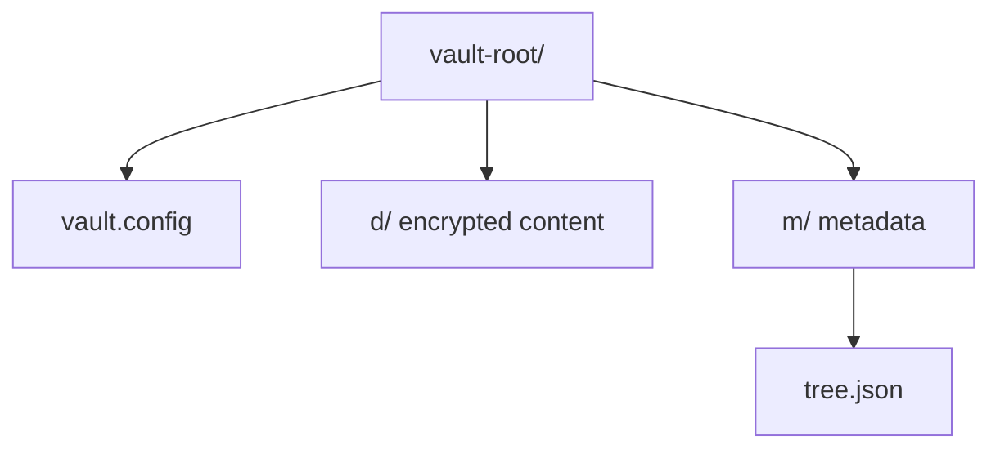

# Vault Format

A vault is organized around encrypted metadata, encrypted content, and an encrypted tree index.

## Simplified layout



## Directory sketch

```text
vault-root/
├── vault.config
├── d/
└── m/
    └── tree.json
```

## Components

- `vault.config` — encrypted metadata including salt, KDF parameters, and versioning
- `d/` — encrypted file content
- `m/tree.json` — encrypted directory tree index

## Operational notes

- File content is encrypted in chunks
- Directory and filename information is protected
- Integrity checks are part of the design, not a separate afterthought
- Layout details may evolve before the format is declared stable
